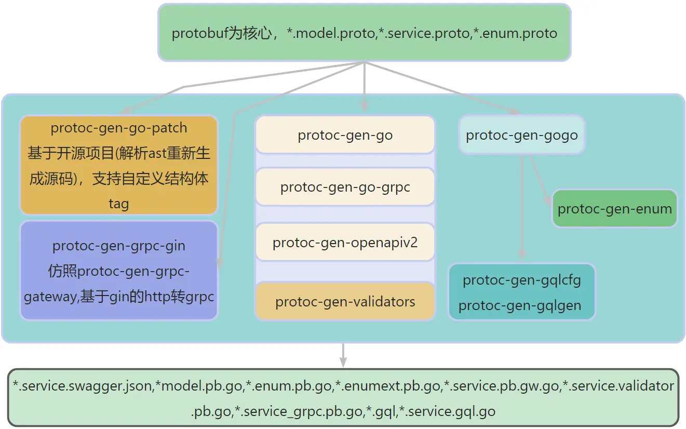

# protobuf
protobuf插件集合, 常用proto类型
一个proto文件生产grpc,http,graphql三种接口


## quick start
- `go get github.com/hopeio/protobuf@main`
- `go run $(go list -m -f {{.Dir}}  github.com/hopeio/protobuf)/tools/install_tools.go`
- `protogen go -p $proto_path -o $proto_output_path`

#### use docker
`docker run --rm -v $project_path:/work jybl/protogen protogen go --proto=$proto_path --genpath=$proto_output_path`


## template
user.proto
```protobuf
syntax = "proto3";
package user;
import "hopeio/utils/enum/enum.proto";
import "hopeio/utils/patch/go.proto";
import "protoc-gen-openapiv2/options/annotations.proto";
import "hopeio/utils/validator/validator.proto";
import "google/api/annotations.proto";
import "hopeio/response/response.proto";
import "hopeio/request/param.proto";
import "danielvladco/protobuf/graphql.proto";
import "hopeio/oauth/oauth.proto";
import "google/protobuf/wrappers.proto";

option java_package = "protobuf.user";
option go_package = "protobuf/user";
option (enum.gqlgen_all) = true;
option (enum.no_prefix_all) = false;
option (go.file) = {no_enum_prefix:true};
option (grpc.gateway.protoc_gen_openapiv2.options.openapiv2_swagger) = {
  info: {
    version: "1.0"
  }
};
// 用户
message User {
  uint64 id = 1 [(go.field) = {tags:'gorm:"primaryKey;"'}];
  string name = 2 [(go.field) = {tags:'gorm:"size:10;not null" comment:"昵称"'}];
    // 性别，0未填写，1男，2女
  Gender gender = 8 [(go.field) = {tags:'gorm:"type:int2;default:0"'}, (grpc.gateway.protoc_gen_openapiv2.options.openapiv2_field) = {
    type:INTEGER
  }];
}

// 用户性别
enum Gender{
  GenderPlaceholder = 0 [(enum.text)= "占位"];
  GenderMale = 1 [(enum.text)= "男"];
  GenderFemale = 2 [(enum.text)= "女"];
}

service UserService {

  option (grpc.gateway.protoc_gen_openapiv2.options.openapiv2_tag) = {
    description: "用户相关接口"
  };
  //获取用户信息
  rpc Info (request.Id) returns (User) {
    option (google.api.http) = {
      get: "/api/v1/user/{id}"
    };
    option (grpc.gateway.protoc_gen_openapiv2.options.openapiv2_operation) = {
      tags:["用户相关接口", "v1.0.0"]
      summary : "获取用户信息"
      description : "根据Id获取用户信息接口"
    };
    option (danielvladco.protobuf.graphql.rpc) = {type: QUERY};
  }

}
```
# contribute

## 生成库protobuf代码
`go run protobuf/generate.go`

## tools
本项目需要用到的protobuf插件，`go run tools/install_tools.go` 或 `tools/install-tools.sh`，会自动安装

- protogen为go语言写的protobuf生成程序
    - go/dart 生成go/dart文件，E.g: protogen go -p xxx -o xxx
    - -p proto dir
    - -o generate dir
    - -e 是否使用enum扩展插件
    - -w 是否使用grpc-gateway插件
    - -v 是否使用validators插件
    - -g 是否使用graphql插件
    - --patch 是否使用原生protopatch
- protoc-go-patch 支持通过ast重新生成自定义结构体tag,生成结构体方法等功能
- protoc-gen-grpc-gin github.com/grpc-ecosystem/grpc-gateway/v2/protoc-gen-grpc-gateway的gin版本，支持生成http路由代理转发到grpc sercvice中
- protoc-gin-enum 分为错误enum及普通enum，生成性能更高支持中文的`String()`,错误enum会额外生成`Error()string`，支持生成枚举的辅助方法,错误enum会额外生成`Error()string`
- protoc-gen-validator 用于生成请求的校验的代码
- 集成github.com/grpc-ecosystem/grpc-gateway/v2/protoc-gen-openapiv2 用于生成swagger文档
- 集成github.com/danielvladco/go-proto-gql 用于生成graphql schema 及 grahpql服务

### build docker image
```base
`$protobuf_dir/tools/docker/docker_build_local.sh $GOPATH $PROTOC $Image`
```
### upgrade go
`docker build -t jybl/protogen -f $protobuf_dir/tools/docker/Dockerfile_upgrade .`
